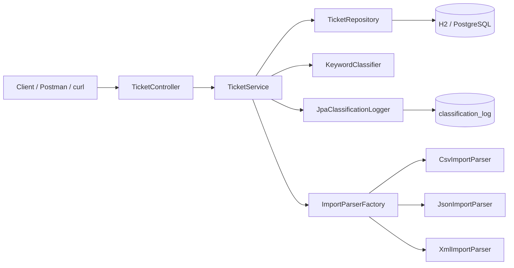
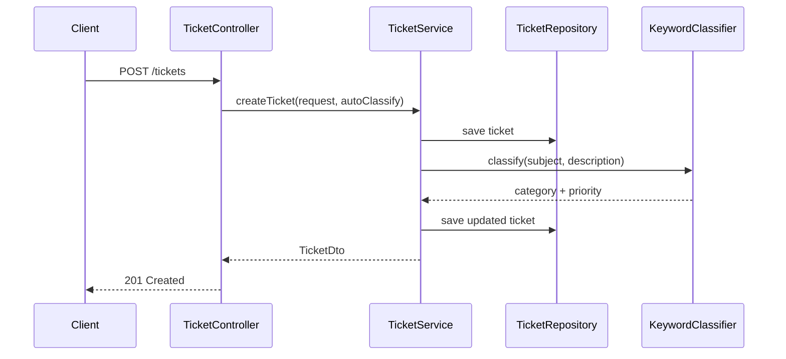

# Architecture Guide

## Overview

The project follows a layered Spring Boot architecture with clear separation between controller, service, repository, and import parsing concerns.

## Component responsibilities

- Controller: exposes REST endpoints and delegates to the service layer.
- Service: coordinates ticket creation, validation, classification, updates, and imports.
- Repository: persists tickets and classification logs with Spring Data JPA.
- Classifier: assigns category and priority using keyword matching.
- Import parsers: parse CSV, JSON, and XML files into validated ticket requests.
- Exception handler: normalizes runtime problems into consistent HTTP responses.

## Request flow

## Design decisions

- Spring Boot + JPA reduces boilerplate and makes persistence straightforward.
- Keyword-based classification keeps the MVP simple and deterministic.
- Import parsers follow a common ParseResult contract so failures can be reported without aborting the whole batch.
- Validation is enforced both in the controller and in the service import pipeline to keep invalid data out of storage.

## Security considerations

- **XML external entity (XXE) protection**: `XmlImportParser` explicitly disables DOCTYPE declarations and external general/parameter entities on the `DocumentBuilderFactory` before parsing any uploaded XML, preventing XXE-based file disclosure or SSRF via crafted import files.
- **Input validation at every entry point**: Jakarta Bean Validation (`@Email`, `@Size`, `@NotBlank`) runs on single-ticket create/update via `@Valid`, and `TicketValidator` re-runs the same constraints for every record produced by the bulk import pipeline, so imported data cannot bypass the rules enforced on the single-ticket API.
- **No stack traces leaked to clients**: `GlobalExceptionHandler`'s catch-all handler logs the full exception server-side but returns a generic `"An internal error occurred"` message, avoiding disclosure of internal implementation details.
- **Enum and status parsing is allow-listed**: CSV/JSON/XML field mapping only accepts values matching a known enum constant (case-insensitively); anything else is rejected as a per-record `ImportError` rather than being coerced or silently accepted.
- **Not yet implemented**: authentication/authorization, rate limiting, and audit-log tamper protection are out of scope for this assignment but would be required before exposing the API publicly.

## Performance considerations

- **Bulk import is O(n) per file**: each record is parsed, validated, and persisted independently, so a partial failure in one record never aborts the batch; the trade-off is one `INSERT` per successful ticket rather than a single batched insert, which is simpler but slower for very large files.
- **Filtering is pushed to the database**: `GET /tickets` uses a JPA `Specification` (`TicketSpecification.withFilter`) so category/priority/status filters are applied in SQL rather than in application memory.
- **Classification is pure in-memory keyword matching**: `KeywordClassifier` does simple substring scans over a small, fixed keyword table with no external calls, keeping classification latency negligible compared to the database round-trip that surrounds it.
- **H2 in-memory database for dev/test**: fast to start and reset (`ddl-auto=create-drop`), but a `PostgreSQL` profile (`application-prod.properties`) is provided for production-like performance and durability.
- See `TESTING_GUIDE.md` for the measured performance benchmark results.
