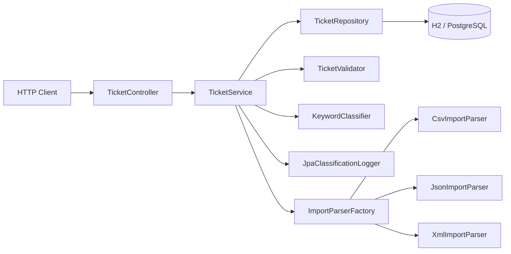

# Intelligent Customer Support System

A Spring Boot 3 REST API for managing customer support tickets: bulk-importing them from CSV/JSON/XML, automatically classifying category and priority from keywords, and persisting an audit trail of every classification decision.

## Features

- Full CRUD for support tickets (`POST` / `GET` / `PUT` / `DELETE /tickets`)
- Bulk import from CSV, JSON, and XML, with a per-record success/failure summary
- Keyword-driven category and priority auto-classification, with confidence score and reasoning
- Append-only classification audit log (every automatic or manual classification decision is recorded)
- Filtering ticket lists by category, priority, and status (combinable)
- Bean-validated input (email format, string length bounds, enum values) with consistent JSON error responses
- H2 in-memory database for local development/tests; a PostgreSQL profile for production (`application-prod.properties`)

## Architecture



See [ARCHITECTURE.md](ARCHITECTURE.md) for component responsibilities, request-flow sequence diagrams, and design/security/performance trade-offs.

## Tech stack

- Java 17, Spring Boot 3.2.5 (Web, Data JPA, Validation)
- H2 (dev/test) / PostgreSQL (prod profile)
- OpenCSV, Jackson, JAXB for CSV/JSON/XML parsing
- JUnit 5, Mockito, AssertJ, jqwik (property-based testing), Jacoco (coverage)

## Getting started

### Prerequisites

- JDK 17 or newer
- Maven 3.6+

### Run the API

```bash
cd src
mvn spring-boot:run
```

The API is available at `http://localhost:8080`. The H2 console is available at `http://localhost:8080/h2-console` (JDBC URL `jdbc:h2:mem:testdb`, user `sa`, empty password).

To run against PostgreSQL instead of the in-memory H2 database, activate the `prod` profile (configure `application-prod.properties` with your database credentials first):

```bash
mvn spring-boot:run -Dspring-boot.run.profiles=prod
```

### Build a runnable JAR

```bash
cd src
mvn package
java -jar target/customer-support-1.0.0-SNAPSHOT.jar
```

## Running tests

```bash
cd src
mvn test
```

This runs the full suite (155+ JUnit 5 and jqwik tests) and generates a Jacoco coverage report at `src/target/site/jacoco/index.html`. Current coverage is **91% instruction / 94% line**, exceeding the 85% target — see [`docs/screenshots/test_coverage.png`](docs/screenshots/test_coverage.png) and [TESTING_GUIDE.md](TESTING_GUIDE.md) for the full breakdown and performance benchmarks.

## Project structure

```
homework-2/
├── src/
│   ├── pom.xml                    # Maven build (Spring Boot 3.2.5, Java 17)
│   └── src/
│       ├── main/java/com/example/support/
│       │   ├── controller/        # REST endpoints
│       │   ├── service/           # TicketService, TicketValidator
│       │   ├── classifier/        # Keyword-based category/priority classification
│       │   ├── importer/          # CSV / JSON / XML parsers
│       │   ├── audit/             # Classification decision logging
│       │   ├── repository/        # Spring Data JPA repositories & specifications
│       │   ├── model/             # JPA entities and enums
│       │   ├── dto/                # Request/response payloads
│       │   └── exception/         # Global exception handling
│       ├── main/resources/        # application.properties (H2 / prod)
│       └── test/
│           ├── java/com/example/support/   # unit, property, integration, performance tests
│           └── resources/fixtures/         # shared sample CSV/JSON/XML for import tests
├── demo/                          # sample_tickets.{csv,json,xml} + invalid_tickets.*
├── docs/screenshots/              # test coverage report screenshot
├── README.md                      # this file
├── API_REFERENCE.md               # endpoint reference with curl examples
├── ARCHITECTURE.md                # component design, data flow, security/performance notes
└── TESTING_GUIDE.md               # test suite breakdown, benchmarks, manual checklist
```

## Documentation

| Document | Audience |
|---|---|
| [API_REFERENCE.md](API_REFERENCE.md) | API consumers — every endpoint with request/response examples and curl commands |
| [ARCHITECTURE.md](ARCHITECTURE.md) | Technical leads — component design, sequence diagrams, trade-offs |
| [TESTING_GUIDE.md](TESTING_GUIDE.md) | QA engineers — how to run tests, sample data, manual checklist, benchmarks |

## Sample data

Located in [`demo/`](demo/), used for manual testing and bulk-import demos:

- `sample_tickets.csv` — 50 valid tickets
- `sample_tickets.json` — 20 valid tickets
- `sample_tickets.xml` — 30 valid tickets
- `invalid_tickets.{csv,json,xml}` — malformed/invalid records for negative testing (bad email, unknown enum values, description/subject length violations, etc.)
