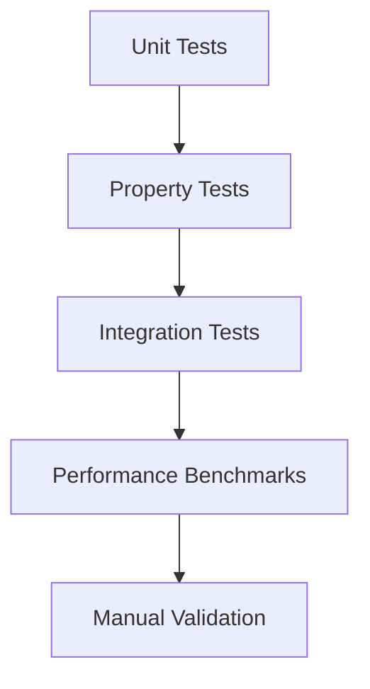

# Testing Guide

## Test strategy

The project uses a mix of unit, property-based, integration, and performance tests to cover behavior and regressions.



## Running tests

```bash
cd src
mvn test
```

This runs the full suite (JUnit 5 + jqwik property tests) and produces a Jacoco coverage report at `src/target/site/jacoco/index.html`.

To view the HTML coverage report locally:

```bash
cd src
mvn test
start target/site/jacoco/index.html   # Windows
```

## Test suite breakdown

| Required file (TASKS.md) | Actual test class(es) | Test count | Notes |
|---|---|---|---|
| `test_ticket_api` (11) | `TicketControllerTest` | 28 | All 6 REST endpoints, success + error paths |
| `test_ticket_model` (9) | `TicketValidatorTest` | 11 | Boundary tests for every `@Size`/`@Email`/`@NotBlank` rule on create & update |
| `test_import_csv` (6) | `CsvImportParserTest` | 6 | Header case-insensitivity, tag separators, blank fields, unreadable stream |
| `test_import_json` (5) | `JsonImportParserTest` | 5 | Per-element errors, malformed document, empty array, unreadable stream |
| `test_import_xml` (5) | `XmlImportParserTest` | 5 | Per-element errors, malformed document, missing tags, XXE rejection |
| `test_categorization` (10) | `KeywordClassifierTest` + `ClassifierPrecedencePropertyTest` + `ClassifierResultPropertyTest` | 50+ | Every category/priority keyword table, tie-breaking, jqwik property tests |
| `test_integration` (5) | `TicketIntegrationTest` | 6 | Full lifecycle, bulk import + classification, 25 concurrent requests, combined filtering, 400 regression, audit log |
| `test_performance` (5) | `PerformanceBenchmarkTest` | 5 | See benchmarks table below |
| `fixtures/` | `src/test/resources/fixtures/` | — | Shared valid/malformed CSV, JSON, XML sample files used by the import parser tests |

Additional supporting suites: `ImportParserFactoryTest`, `GlobalExceptionHandlerTest`, `TicketServiceTest` / `TicketServiceCoverageTest` / `TicketServiceAdditionalBranchesTest`, `ClassificationLogPropertyTest`, `CoverageSmokeTest`.

## Coverage

Current measured coverage (Jacoco, `src/target/site/jacoco/jacoco.csv`): **91% instruction / 94% line**, exceeding the 85% requirement.

Coverage report screenshot: [`docs/screenshots/test_coverage.png`](docs/screenshots/test_coverage.png).

## Sample data locations

- CSV: `demo/sample_tickets.csv` (50 tickets)
- JSON: `demo/sample_tickets.json` (20 tickets)
- XML: `demo/sample_tickets.xml` (30 tickets)
- Invalid samples (negative tests): `demo/invalid_tickets.csv`, `demo/invalid_tickets.json`, `demo/invalid_tickets.xml`
- Shared parser test fixtures: `src/test/resources/fixtures/` (valid + malformed CSV/JSON/XML)

## Performance benchmarks

Measured on developer hardware via `PerformanceBenchmarkTest` (service layer against the real H2-backed repository, JDK 21). Thresholds in the test are set well above these figures to avoid CI flakiness while still catching severe regressions.

| Benchmark | Volume | Measured | Threshold | Result |
|---|---|---|---|---|
| Ticket creation | 200 sequential creates | 490 ms total / 2.45 ms per op | < 100 ms/op avg | ✅ Pass |
| Bulk import | 200-row CSV | 302 ms total | < 10,000 ms | ✅ Pass |
| List tickets | 500 records | 259 ms | < 5,000 ms | ✅ Pass |
| Classification | 2,000 calls | 57 ms total / 28.5 µs per op | < 2,000 ms total | ✅ Pass |
| Concurrent reads | 25 threads × 100 records | 352 ms total | < 10,000 ms | ✅ Pass |

## Manual validation checklist

- [ ] Create a ticket via `POST /tickets`
- [ ] Create a ticket with `?autoClassify=true` and confirm category/priority are set and an audit log entry is written
- [ ] Import a mixed valid/invalid CSV file through `POST /tickets/import` and confirm the summary reports correct total/successful/failed counts
- [ ] Import an empty file and confirm `400 Bad Request` (not `500`)
- [ ] Import an unsupported file extension and confirm `415 Unsupported Media Type`
- [ ] Trigger auto-classification with `POST /tickets/{id}/auto-classify` and confirm confidence score, reasoning, and keywords are returned
- [ ] Manually override category/priority via `PUT /tickets/{id}` and confirm the override is logged
- [ ] Filter `GET /tickets` by category, priority, status, and combinations of the three
- [ ] Update a ticket to `resolved` and confirm `resolved_at` is populated
- [ ] Delete a ticket and verify `404` on subsequent lookup
- [ ] Fire 20+ concurrent `POST /tickets` requests and confirm all succeed with unique IDs
